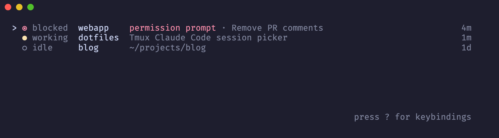
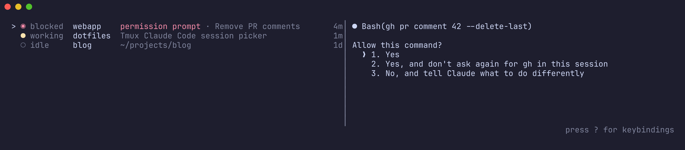
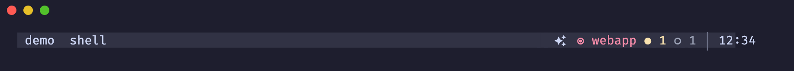

<p align="center">
  
</p>

# tmux-agents

A tmux popup listing the Claude Code sessions in the current server, what each
is doing, and a jump to its pane. Also a status-line segment and a blocked-alert
watcher.



Keys: `j/k` move, `1-9` focus the numbered row, `/` filter, `Enter` focus, `n` new Claude
pane, `x` kill (asks `y/n`), `p` toggle preview, `?` help, `q` quit.

- **Preview**: `p` shows the selected pane's screen on the right (popups ≥ 100
  columns). Off by default; see `[preview]` below.
- **Stale**: a working row unchanged for 30 min reads `stale?`.
- **Labels**: the cwd basename (or a `[labels]` entry); duplicates get
  `:<window index>`.
- **Status line**: blocked sessions by name, the rest as counts.
- **Watch**: flashes `◉ <session>: <reason>` in every client when a session
  becomes blocked.





## Install

Homebrew (macOS, Linux), pulls in `tmux` if missing:

```sh
brew install piacsek/tap/tmux-agents
```

Prebuilt binary (macOS arm64/x86_64, Linux x86_64) into `~/.local/bin`, checked
against the release's SHA-256:

```sh
t="tmux-agents-$(uname -m | sed s/arm64/aarch64/)-$(uname -s | sed 's/Darwin/apple-darwin/;s/Linux/unknown-linux-gnu/')"
curl -fsSLO "https://github.com/piacsek/tmux-agents/releases/latest/download/$t.tar.gz{,.sha256}"
shasum -a 256 -c "$t.tar.gz.sha256" && mkdir -p ~/.local/bin && tar xzf "$t.tar.gz" -C ~/.local/bin
```

Releases also carry a GitHub build-provenance attestation:
`gh attestation verify "$t.tar.gz" --repo piacsek/tmux-agents`.

From source (needs Rust 1.98+):

```sh
cargo install --git https://github.com/piacsek/tmux-agents --locked
```

## Set up tmux

Add to `~/.tmux.conf`, then `tmux source-file ~/.tmux.conf`:

```
bind -n M-c display-popup -E -w 70% -h 60% "tmux-agents"
set -g status-right " #(tmux-agents status) | #(tmux-agents cached 5 -- my-slow-widget) "
set-option -g status-interval 1
run-shell -b "tmux-agents watch"
```

`cached <ttl-seconds> -- <command>` reruns a widget at most once per TTL so the
1s interval stays cheap; a failing command is shown but not cached. `watch` runs one instance per server and exits with it.

Sessions come from Claude Code's registry at `~/.claude/sessions/`, or
`$CLAUDE_CONFIG_DIR/sessions`. tmux runs `#()` and `run-shell` with the
server's environment, so a `CLAUDE_CONFIG_DIR` exported only in your shell
needs `set-environment -g CLAUDE_CONFIG_DIR <dir>` in `.tmux.conf` too.

## Configure

`~/.config/tmux-agents/config.toml` (or `$XDG_CONFIG_HOME`, or
`$TMUX_AGENTS_CONFIG`). Every key is optional; `tmux-agents config` prints the
effective values. Unknown keys are an error.

```toml
[picker]
tick_ms = 500
stale_after_minutes = 30

[preview]
enabled = false        # p toggles at runtime
min_width = 100
split_percent = 50     # list width; preview gets the rest

[status]
prefix = "#[fg=white]󰙴#[default]"   # "" for none
named_blocked = 2      # 0 = count only
max_label = 16         # longer names end in …

[watch]
interval_ms = 1000
quiet_ms = 3000        # per-session re-alert window
display_ms = 4000
skip_active_client = true

[new_pane]
command = "\"${SHELL:-sh}\" -ic claude"   # run by sh -c in the new pane
direction = "horizontal"   # or "vertical"

[labels]               # cwd -> name shown instead of the basename
"~/projects/tmux-agents" = "agents"
```

## Develop

`cargo test`, plus `cargo test -- --ignored` for tests that start a real tmux
server. Details and gotchas in `AGENTS.md`.

## License

MIT.
